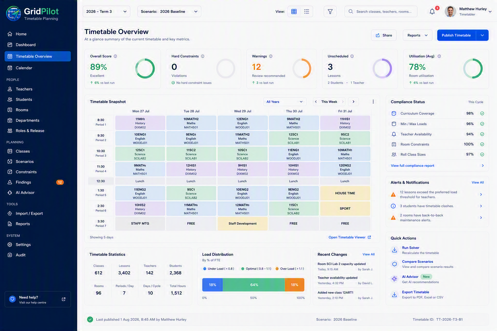

<p align="center">
  
</p>

<p align="center">
  <strong>A local-first co-pilot for school timetabling.</strong><br>
  Ingest a Timetabling Solutions export, analyse it, propose and validate edits, export a file it can re-read — all offline.
</p>

<p align="center">
  
  
  
  
  
</p>

---

GridPilot was built for Sophia College (Brisbane Catholic Education) to
sit alongside Timetabling Solutions, not replace it: load the school's
real `.tfx`/`.sfx` export, see the whole timetable, get a deterministic
list of what's actually wrong with it (clashes, capacity, load,
composite classes), propose and validate fixes without ever touching the
source data, and export an approved change back out as a file
Timetabling Solutions can re-read. Nothing here calls a cloud API —
everything runs on your machine, and the one AI layer this project plans
to add is local-only (Ollama), and only for *explaining* findings, never
for inventing them.

## Contents

- [What's built](#whats-built)
- [Design direction](#design-direction)
- [Quick start](#quick-start)
- [Running it](#running-it)
- [Project layout](#project-layout)
- [Documentation](#documentation)
- [Privacy and data handling](#privacy-and-data-handling)
- [Project status](#project-status)

## What's built

Six milestones, each tested against the school's real Term 3 export, not
synthetic data alone:

| | |
|---|---|
| ✅ **Ingestion + cross-validation** | `.tfx` (primary source) cross-checked against CSV and eMinerva exports; every mismatch surfaced as a structured discrepancy, never silently dropped. Auto-discovers the newest export file — a new term needs no code change. |
| ✅ **Timetable grid** | Filterable by teacher, room, or roll class. Click any lesson to move it - day, period, room, and/or teacher - and see the clash-rule impact immediately, before anything is saved. |
| ✅ **Deterministic rules engine** | Teacher/room/student double-booking, room capacity, teacher load, room utilisation. Composite classes (two class codes taught as one physical lesson) are detected and held in a **human-review queue** — never silently suppressed. |
| ✅ **Safe change sets** | Propose an edit, validate it with a full what-if re-run of the clash rules, then approve or reject. The imported timetable is **never mutated** — approval is a durable record, not a write. |
| ✅ **Constraint-based suggestions** | Searches every valid alternate room/time, rejects anything that fails a hard constraint, ranks what's left by disruption. Deliberately **no AI involved** — this is what the (future) AI advisor will *explain*, not invent. |
| ✅ **Audit trail + export gate** | Every import, rules run, and review decision is logged. An approved change set can be exported to a re-importable `.tfx`, gated behind six validation checks including a full re-ingest through the app's own parser. File-writing is deliberately CLI-only, never a UI button. |
| ✅ **Re-ingest persistence** | Composite-class reviews, change sets, and the audit trail now survive a re-ingest instead of being wiped - state is snapshotted by stable code (teacher/room/class/day/period code) and re-attached to the freshly-loaded data. See [`docs/reingest-persistence.md`](docs/reingest-persistence.md). |
| ✅ **Browser-based import** | Load a `.tfx` and any number of `.sfx` files straight from the UI - no folder wrangling, no CLI. First launch walks you into an import screen automatically; re-importing a fresh export later is one click away from the sidebar. |
| ✅ **Dashboard** | Sidebar navigation plus a real overview page - open findings by severity, composite reviews pending, draft change sets, average room utilisation, entity counts, recent activity. Every number is a live query; nothing simulated (no scenarios, no solver, no invented compliance scores - see [Project status](#project-status)). |
| ✅ **Teachers** | Name, code, faculty, and load (contracted vs. scheduled) straight from the import - read-only. Plus middle-leadership role/tier assignment, the one thing entered directly in GridPilot - kept by teacher **code**, not an internal id, specifically so it survives a re-ingest. |

**Not yet built:** the local AI advisor (Ollama) layer, adding/editing
teacher *records* (name/faculty/load stay view-only - only role
assignment is writable), and anything resembling a solver or
multi-scenario planning (a real architecture change, not a UI addition) -
see [Project status](#project-status).

## Design direction

The UI now follows the target mockups fairly closely — a sidebar, a real
Dashboard, and an editable timetable grid all exist. What's deliberately
*not* built, even though the mockups show it: Scenarios (GridPilot has
one timetable, not branching versions), a solver/"Run Solver" action (no
optimiser exists — deterministic rules only, by design), a real-calendar
Timetable Overview (no calendar-date mapping exists, and guessing one was
explicitly ruled out early on), and compliance-percentage tiles (not
things GridPilot actually computes). See
[`docs/project-status.md`](docs/project-status.md) for the reasoning
behind each.

<p align="center">
  
</p>

## Quick start

```bash
# Backend
cd backend
pip install -e ".[dev]"

# Frontend
cd ../frontend
npm install
```

Point `TT_SOURCE_DIR` at a folder containing a Timetabling Solutions
export (`.tfx`, optionally per-year-level `.sfx` files, and the CSV/
eMinerva exports) — see [Overriding data locations](#overriding-data-locations).

## Running it

```bash
# Start both servers (separate terminals)
cd backend && python -m uvicorn app.api.main:app --port 8000
cd frontend && npm run dev
```

Open **http://localhost:5173**. With no data loaded yet, you'll land on
an import screen — choose the `.tfx` export (required) and any `.sfx`
Student Options files (optional, can be added later), and it ingests and
runs the rules engine immediately. Re-import a fresh export any time via
**Import…** in the sidebar. Six sections once loaded: **Dashboard** (a
real overview - open findings, pending reviews, room utilisation, entity
counts), **Timetable** (click a lesson to move it and see the clash
impact live), **Findings** (with one-click "Suggest fixes" and an
attention-count badge), **Composite Review**, **Change Sets**, and
**Audit**.

Prefer the CLI (scripting, or a file already sitting in
`Timetabler Export/`)? Same ingestion path, just triggered directly:

```bash
cd backend
python -m app.ingest.run       # builds the working database from the export folder
python -m app.analysis.run     # rules engine — findings + composite candidates
```

```bash
# Export an approved change set (dry run by default)
python -m app.export.run --change-set-id 5
python -m app.export.run --change-set-id 5 --confirm    # actually write files

# Clear working data (dry run by default)
python -m app.retention
python -m app.retention --confirm

# Tests (skip automatically without real export data present)
python -m pytest tests/ -v
```

### Overriding data locations

- `TT_SOURCE_DIR` — defaults to `./Timetabler Export`
- `TT_DATA_DIR` — defaults to `./data`
- `TT_OUTPUT_DIR` — defaults to `./output`
- `TT_TFX_PATH` — pin ingestion to one specific `.tfx`, overriding
  auto-discovery of the newest file under `TT_SOURCE_DIR`

## Project layout

```
backend/          FastAPI + SQLite. app/ingest, app/analysis, app/changes, app/export, app/api
frontend/          React + TypeScript + Tailwind, talks to the API only
docs/               Every design decision, written down (see below)
Timetabler Export/  Real export data goes here — gitignored, never committed
data/, output/      Working database and generated exports — gitignored
```

## Documentation

Every non-obvious decision in this project is written down, not just
coded — start with `docs/data-formats.md` if you're new to what a
Timetabling Solutions export actually contains.

| Doc | Covers |
|---|---|
| [`docs/data-formats.md`](docs/data-formats.md) | What every source file actually contains, confirmed against real data |
| [`docs/data-model.md`](docs/data-model.md) | The internal schema, and why |
| [`docs/tfx-compatibility.md`](docs/tfx-compatibility.md) | Handling a different/future export version; auto-discovery |
| [`docs/rules.md`](docs/rules.md) | The rules engine: what each rule checks, composite-class review |
| [`docs/change-sets.md`](docs/change-sets.md) | Proposed edits, what-if validation, why the source is never mutated |
| [`docs/suggestions.md`](docs/suggestions.md) | The algorithmic (non-AI) fix-suggestion engine |
| [`docs/export-validation.md`](docs/export-validation.md) | The six-gate export process, and what it genuinely can't verify |
| [`docs/reingest-persistence.md`](docs/reingest-persistence.md) | How composite reviews, change sets, and the audit trail survive a re-ingest |
| [`docs/privacy-threat-model.md`](docs/privacy-threat-model.md) | Data flows, trust boundaries, audit trail, retention/purge |
| [`docs/project-status.md`](docs/project-status.md) | Honest health review — what's solid, known weaknesses, what's next |
| [`docs/staff-capability-model.md`](docs/staff-capability-model.md), [`staffing-priority-policy.md`](docs/staffing-priority-policy.md), [`staffing-ux-workflows.md`](docs/staffing-ux-workflows.md) | Mapping for a larger staff-capability/allocation addendum — documented, not yet built |
| [`docs/design/`](docs/design/) | UI mockup and logo source assets |

## Privacy and data handling

This started as a tool for handling real student and staff data, and
that constraint shaped everything:

- **No cloud API calls anywhere in this codebase.** The planned AI layer
  is local-only (Ollama), and its job is to explain findings that
  already exist — never to generate or apply timetable changes itself.
- **No PII in logs, findings, or audit records** — every structured
  record uses codes (teacher code, room code, class code, a student's
  numeric code) and never a name or email. This is asserted by tests,
  not just intended.
- **Source data is read-only.** Ingestion never writes back into the
  export folder; every working file lives under a separate, gitignored
  `data/`/`output/` directory.
- **This repository contains no real student or staff data.** The
  `Timetabler Export/` folder (and every `.tfx`/`.sfx`/database/export
  file) is excluded from version control from the first commit — see
  `.gitignore`. Verified directly before this repo went public: every
  currently-tracked file was enumerated, and full git history was
  checked for anything that was ever committed and later removed.

Full detail, including a caveat about OneDrive sync in the original
deployment environment, in [`docs/privacy-threat-model.md`](docs/privacy-threat-model.md).

## Project status

All six `PROJECT_ROADMAP.md` milestones are complete. The honest
self-review in [`docs/project-status.md`](docs/project-status.md) covers
what's solid, the remaining known weaknesses (top of the list: the export
path hasn't yet been trial-imported into an actual Timetabling Solutions
instance — re-ingest persistence, formerly #1, is now fixed, see
[`docs/reingest-persistence.md`](docs/reingest-persistence.md)), and the
recommended order for what's next: trial import → timetable-building UX
→ the Ollama AI advisor.

---

<p align="center">
  <sub>Built with <a href="https://claude.com/claude-code">Claude Code</a> for Sophia College.</sub>
</p>
